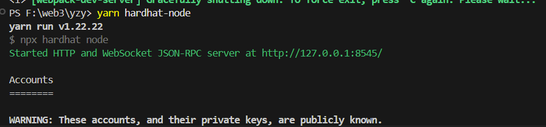
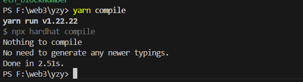
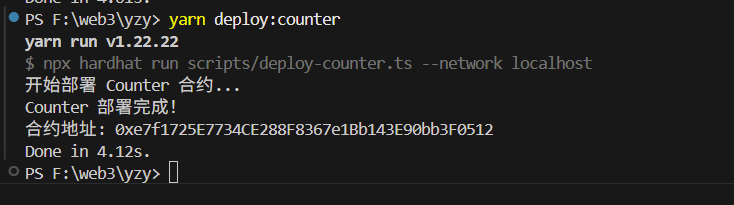
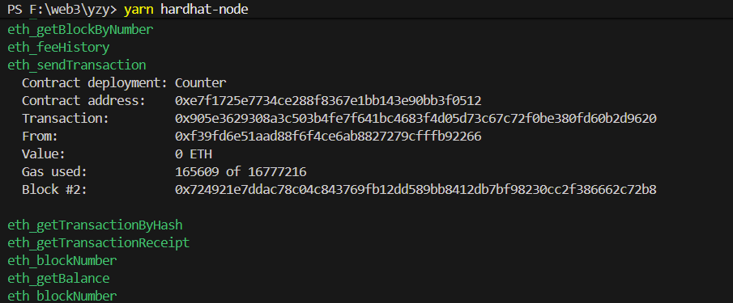
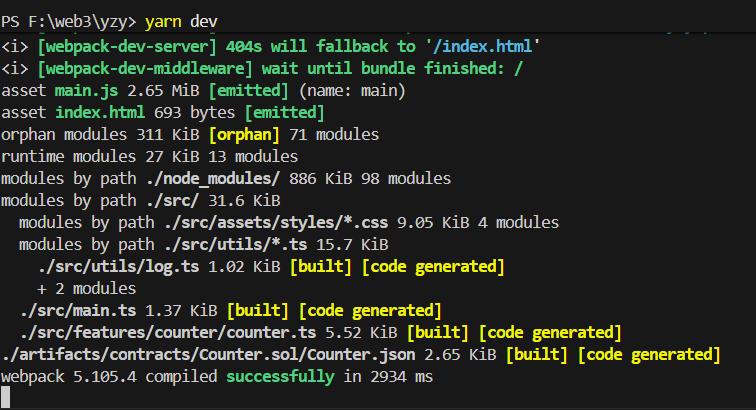
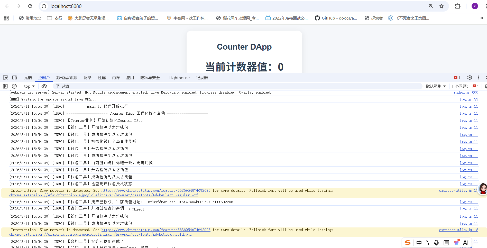
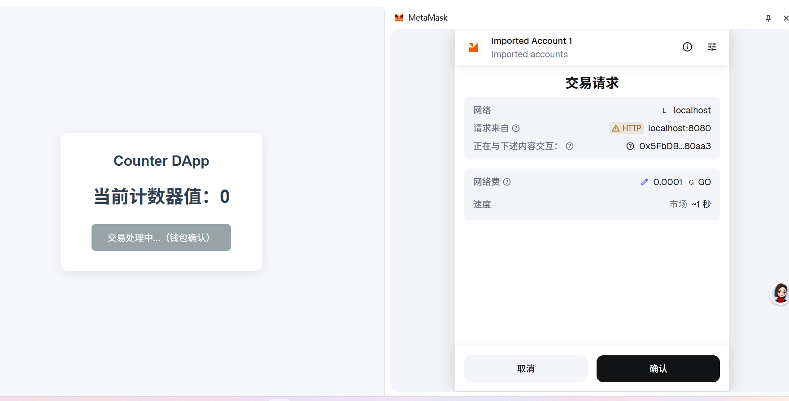
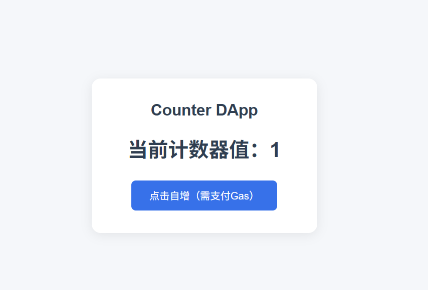
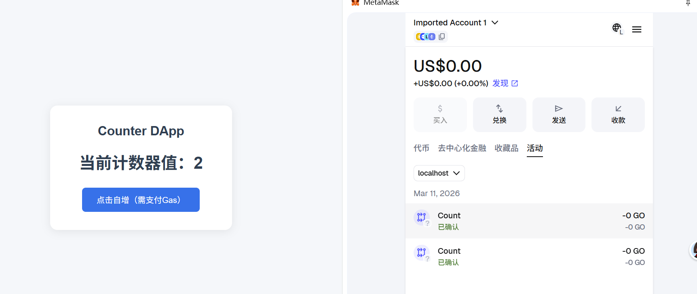

# Dapp Hardhat Project Demo

## 1. 项目介绍

基于 Hardhat 区块链 + MetaMask 钱包 开发的极简去中心化应用（DApp），核心功能是通过链上智能合约实现「计数器自增」操作，完整覆盖新手入门 DApp 开发的核心流程：钱包连接与授权、链 ID 校验与自动切换、智能合约部署与链上交互。

## 2. 功能

### 2.1. 钱包交互基础
1、自动检测 MetaMask 钱包是否安装，无钱包时给出友好提示；
2、校验用户钱包授权状态，未授权时引导完成账户授权；
3、动态配置目标链 ID（通过环境变量 TARGET_CHAIN_ID），自动校验当前链是否匹配：
4、链匹配时直接初始化合约交互；
5、链不匹配时引导切换 / 添加目标链（兼容 Hardhat 本地链 31337/1337 等配置）；
6、兼容 MetaMask 不同版本 RPC 接口，处理链配置冲突、重复请求等常见异常。

### 2.2. 智能合约交互
1、合约相关命令集成 webpack、包含测试、编译、部署、清理。
2、实时查询链上计数器数值并渲染到前端页面 测试demo。
3、点击按钮触发链上交易：调用合约方法，MetaMask 自动弹窗确认交易，交易上链后更新计数器数值。

## 3. 相关命令

启动前端 DApp（核心）: yarn dev
生产环境打包 : yarn build
部署 Counter 合约到链上	: yarn deploy:counter
部署 helloWorld 合约部署到链上 :yarn deploy:helloWorld
编译 : yarn compile
启动本地区块链网络 : yarn hardhat-node

## 4. 效果
启动本地区块链网络。
yarn hardhat-node

编译合约:
yarn compile

部署后面交互的合约:
yarn deploy:counter

区块链日志:

智能合约交互:
启动项目:

yarn dev

合约交互:

